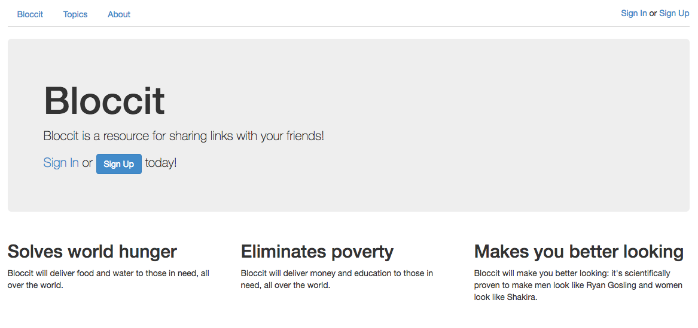

== README

## Bloccit: a Reddit replica to teach the fundamentals of web development and Rails.

### Specs

Ruby Version: 2.3.x

Rails Version: 4.2.5

Authentication: Custom

Authorization: Custom

Test Suite: RSpec, Factory Girl, Shoulda

Database: SQLite3 (development), PostgreSQL (production)

Other Dependencies: Bootstrap, Figaro

Made with my mentor at [Bloc](http://bloc.io).
